# Secret Chef!

Secret Chef is a website for sharing recipes with other secret chefs at home. The site targets everyone who likes to impress their guests with good food and would like to improve their cooking and baking skills.

## CONTENT

* [How does Secret Chef work?](#what-does-the-app-do)
* [Styling that are consistent on the app](#consistent-styling)
  * [Navigation](#navigaion-bar)
  * [Header](#header)
  * [Footer](#footer )

* [Element styling that aren't consistent](#the-windows)
  * [Home](#home)
  * [About](#about)
  * [Register](#register)
* [Admin panel](#admin-panel)
* [Technologies used](#technologies-used)
* [Features](#features)
* [Features left to implement](#features-left-to-implement)
* [Testing](#testing)
* [Bugs and issues along the way](#issues)
* [Heroku](#creating-a-app-on-heroku)
* [Credits](#credits)
  * [Media](#media)
  * [Acknowledgments](#acknowledgments)

  ## What does the app do?
* As a user just visiting the page you are able to read the admins blog posts and comments and also view the amount of likes a post have. But as a logged in user you are able to:
   * Comment on the posts and by that being able to conversate with other users.
   * Like and unlike posts.

## Consistent styling 

### Navigation Bar
* The navigation bar includes responsive links to the home, about, login, logout and register page. 
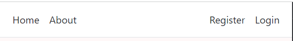
  
### Header- Seret Chef!
* The header containes the applications name 
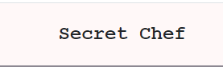

### Footer
* The Footer has navigation links that opens in a new window when used. One to our Facebook page, one for Instagram and one to our youtube chanel. 
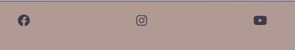

**These elements are constant on each page for easy navigation.**

## The windows 

### Home Page 

* The home page is where you can see the blogposts thats been posted, the author of the post, what time and date it was and how many likes the post has.

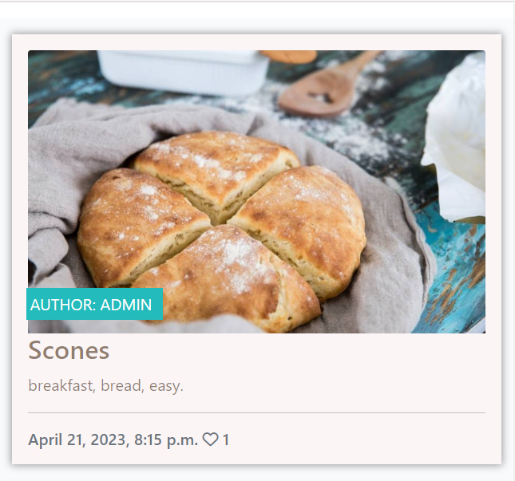

1. By pressing the title of the post in this case "Scones" you'll enter that specific post.
2. From here you can read the description of the recipe. 
3. You can also read the comments and comment if your a user.
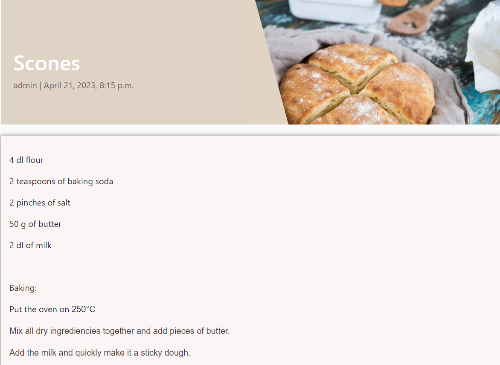

  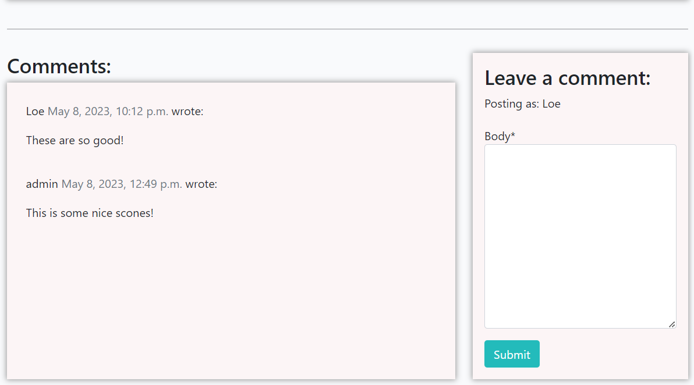

### About

* The about page contains a short description of the reason of this app.

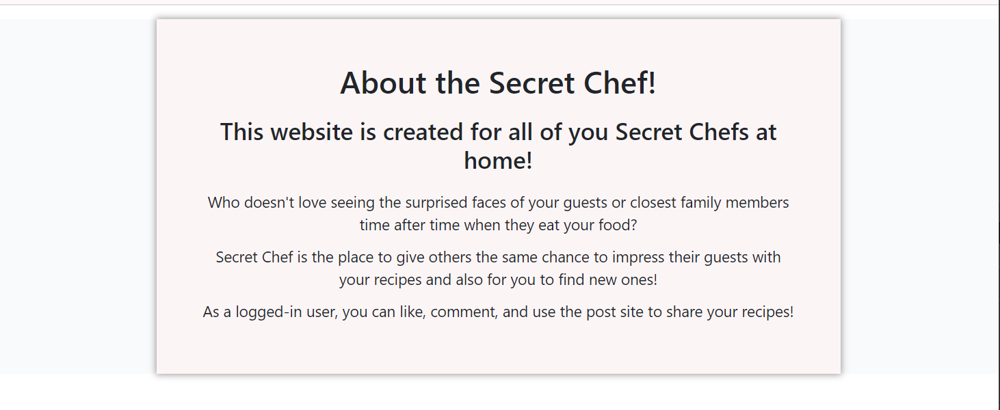

### Register 

* If your new to the page you will see register and login in the navbar. 
* If your already logged-in you will see signout.

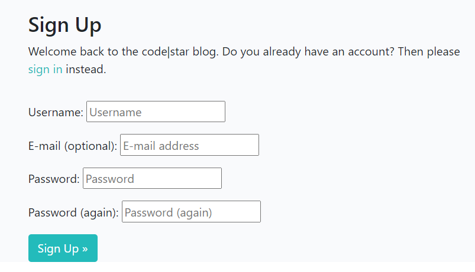

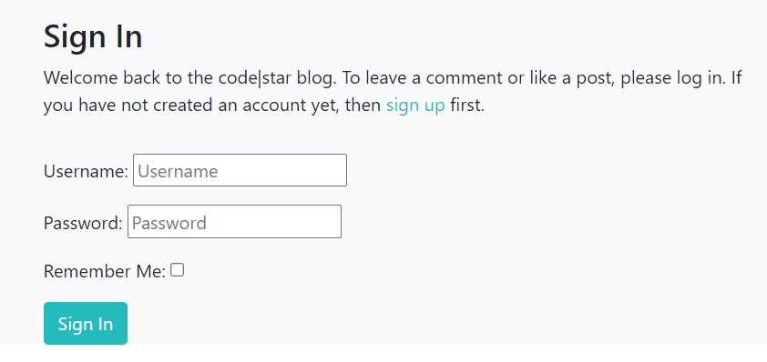

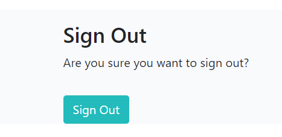

## Admin
With Djangos build in batteries included as they say in the walkthrough project I created an admin panel the same way as in the project. From here me as a admin can write, edit and delete posts and also approve, dismiss, edit and delete users comments.

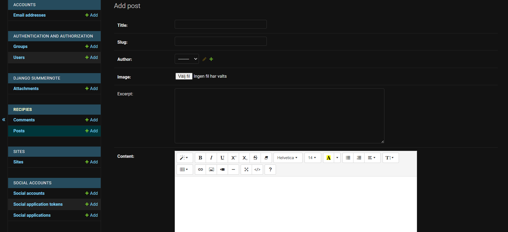

## Technologies used

- [Python](https://www.python.org/) is the language used to achive my goals with this app.  
    - To get access I used [Google Auth](https://google-auth.readthedocs.io/en/master/)
- [GitHub](https://github.com/) stored my app from the first time I pushed it.
- [Gitpod](https://www.gitpod.io/) made it possible to write my code.
- [Heroku](https://dashboard.heroku.com/apps) is where I depoyed my app.ct.
- [Google Sheets](https://www.google.co.uk/sheets/about/) used to store all workout programs and process.
- [Pep8](http://pep8online.com/) was used to test my code for any issues or errors.

## Features

* A lot of the styling is styled with help of Bootstrap classes. The best part in my opinion of why using bootstrap is that it styles elements in columns and therefore automatically looks good on any screensize.
* I've used cloudinary storage, allauth and summernote for this project to be possible. 
* Elephant SQL is used to help posting and fetching info back and forth of the database.
* If a blogg post would be missing a picture there is a backup photo of food to be shown to make the post always appear nice and concistent.
* From the Django form I also used the messages that appears after the user is registrating/loggin in and loggin out. With some javascript they also go away by them self after a while. 

## Features left to implement

1. I would love the users to being able to interfear with the blog more than with likes and comments. Just like some options on the app only is viewable when logged in. I would like there to be one more window shown at times like this. A post window with a form for users to share their recipes with:
 * A title.
 * The measurements.
 * A description.
 * An uploaded photo.
Futher on I would like this just like with comments to end up in the admin panel awaiting approval for being posted.

2. I would also like the users to being able to edit there comments.

## Testing

1. My page appear good on desktop (1201px and up) and also on smaller screens (1200px and below). 

2. Page works good on chrome, firefox, iphone and android.

3. All links are tested in each try of diffrent browsers and all opens in a new window for good ux.

### Validator Testing

Url for secret chef is tested in both [W3C-validator](https://validator.w3.org/) and [W3C-CSS-validaor](http://jigsaw.w3.org/css-validator/validator?lang=sv&profile=css3svg&uri=https%3A%2F%2Fohdamnitsnikki.github.io%2Fnew-parent%2F&usermedium=all&vextwarning=&warning=1)

### Bugs
* My main idea with this project was to implement the form as I mentiones under features left to implement. Unfortunately I spend to much time on trying to make that work that I had to little time left to work on other parts. With the help of my mentor, the tutors and even reaching out to chat GTP I didn't manage to make it. I tried both with writing a bootstrap and a cripy form and connect it with the appropiate code through urls.py, forms.py, models.py and admin.py. 

The migrations went fine and the new category for user recepies ended up in the panel but for some reason I couldn't make the crispy form work in my html file.

### Deployment 

**_Secret Chef_** is deployed to GitHub pages, this was the steps:
* Through the GitHub repository go to settings
* Click on pages and use the branch menu to choose "main"
* Refresh the page and a link to the final project will be deployed

Live link here - [Secret Chef](https://ohdamnitsnikki.github.io/secret_chef/)

* On the main site there is a fork button to create your own repository without affecting the orginal project or you could go into the project file and use the code button and clone the project directly.

## Creating a app on Heroku

(This explanation of deploying is described by AJ Greaves
)
This app is deployed on Heroku.

When you create the app, you will need to add two buildpacks from the _Settings_ tab. The ordering is as follows:

1. `heroku/python`
2. `heroku/nodejs`

You must then create a _Config Var_ called `PORT`. Set this to `8000`

If you have credentials, such as in the Love Sandwiches project, you must create another _Config Var_ called `CREDS` and paste the JSON into the value field.

Connect your GitHub repository and deploy as normal.

## Credits

1. The template is taken from [Code Institute](https://github.com/Code-Institute-Org/gitpod-full-template)
2. For help during these projects I've used my mentor, the tutors and the I think therfore I blog walkthrough project.
3. The form for registration, sign in and sign out is completely built with djangos premade forms. Also the blog posts html code is from the walkthrough project. I've just added in some colours to make it fit my page since the content already looked so good. That also goes for the comment content and comment form. 
4. To get inspired about box-shadows and subsribe button I've used [W3School](https://www.w3schools.com/)
5. To understand how to style img in readme file I've used code from [SeanCDavid](https://www.seancdavis.com/posts/three-ways-to-add-image-to-github-readme/)

